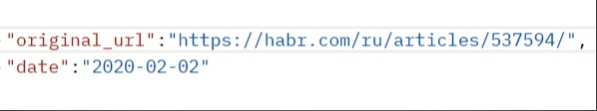
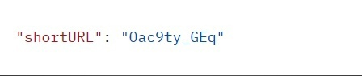
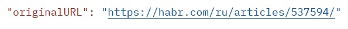

# Cервис по созданию сокращённых ссылок
***
## Описание задачи
***
### Ссылка должна быть:
* Уникальной; на один оригинальный URL должна ссылаться только одна
сокращенная ссылка;
* Длиной 10 символов;
* Из символов латинского алфавита в нижнем и верхнем регистре, цифр и
символа _ (подчеркивание).
### Сервис должен быть написан на Go и принимать следующие запросы по http:
1. Метод Post, который будет сохранять оригинальный URL в базе и
   возвращать сокращённый.
2. Метод Get, который будет принимать сокращённый URL и возвращать
   оригинальный.
### Решение должно соответствовать условиям:
* Сервис распространён в виде Docker-образа;
* В качестве хранилища ожидаем in-memory решение и PostgreSQL. Какое
хранилище использовать, указывается параметром при запуске сервиса;
* Реализованный функционал покрыт Unit-тестами.
***
## Работа сервса 
***
### Post /url/short
* запрос:localhost:8080/url/short
  request
 
* ответ:
 
### Get /url/:short
* запрос:localhost:8080/url/Oac9ty_GEq
* ответ: 
 
***
## Сборка и запуск через docker-compose
***
### Запуск с PostgreSQL хранилищем
docker-compose build app_db
docker-compose run -p 127.0.0.1:8080:8080 -d app_db
### Запуск с in-memory хранилищем
docker-compose build app_im
docker-compose run -p 127.0.0.1:8080:8080 -d app_im